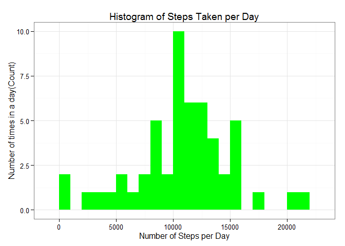
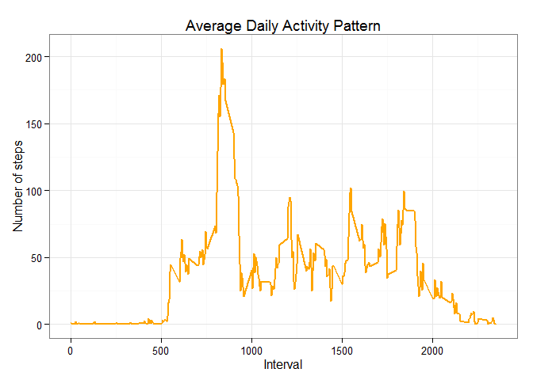
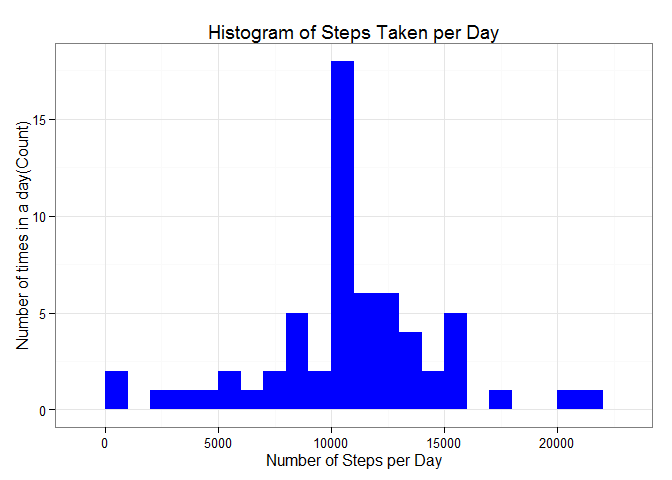
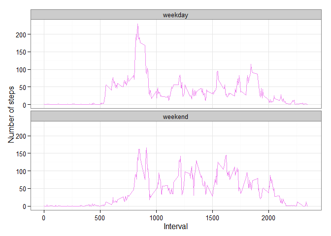

# Reproducible Research: Peer Assessment 1


## Prepare the R environment
Set the working directory using `setwd()` function

```r
# Clear the workspace
rm(list=ls())

# Load library
library(knitr)
```

```
## Warning: package 'knitr' was built under R version 3.2.2
```

```r
library(data.table)
```

```
## Warning: package 'data.table' was built under R version 3.2.1
```

```r
library(ggplot2)
```


## Loading and preprocessing the data
1. Load the data


```r
file_name = "activity.zip"
Url = "https://d396qusza40orc.cloudfront.net/repdata%2Fdata%2Factivity.zip"
if (!file.exists(file_name)) {
        download.file(Url, destfile = file_name)
}
csv_file <- unz(file_name, "activity.csv")
activity <- read.csv(csv_file, header=T, colClasses=c("numeric","character", "numeric"))
```

2. Process/transform the data (if necessary) into a format suitable for your analysis


```r
activity$interval <- factor(activity$interval)
activity$date <- as.Date(activity$date, format = "%Y-%m-%d")
```


## What is mean total number of steps taken per day?
The missing values in the dataset is ignored in this part.

1. Calculate the total number of steps taken per day


```r
steps_per_day <- aggregate(steps ~ date, activity, sum)
colnames(steps_per_day) <- c("date","steps")
```

2. Make a histogram of the total number of steps taken each day


```r
ggplot(steps_per_day, aes(x = steps)) + 
        geom_histogram(fill = "green", binwidth = 1000) + 
        labs(title="Histogram of Steps Taken per Day", 
             x = "Number of Steps per Day", 
             y = "Number of times in a day(Count)") + 
        theme_bw()
```

 

3. Calculate and report the mean and median total number of steps taken per day


```r
steps_mean <- mean(steps_per_day$steps, na.rm=TRUE)
steps_median <- median(steps_per_day$steps, na.rm=TRUE)
```

The mean is **10766.189** and median is **10765**.


## What is the average daily activity pattern?
The missing values in the dataset is ignored in this part.

1. Make a time series plot of the 5-minute interval (x-axis) and the average number of steps taken, averaged across all days (y-axis)


```r
steps_per_interval <- aggregate(activity$steps,
                                by = list(interval = activity$interval),
                                FUN=mean, na.rm=TRUE)
steps_per_interval$interval <- as.integer(levels(steps_per_interval$interval)[steps_per_interval$interval])
colnames(steps_per_interval) <- c("interval", "steps")
```


```r
ggplot(steps_per_interval, aes(x=interval, y=steps)) +
        geom_line(color="orange", size=1) +  
        labs(title="Average Daily Activity Pattern", 
             x="Interval", 
             y="Number of steps") +
        theme_bw()
```

 

2. Which 5-minute interval, on average across all the days in the dataset, contains the maximum number of steps?


```r
max_interval <- steps_per_interval[which.max(steps_per_interval$steps),]
```

The **835<sup>th</sup>** interval has maximum **206** steps.


## Imputing missing values
1. Calculate and report the total number of missing values in the dataset (i.e. the total number of rows with NAs)


```r
missing_vals <- sum(is.na(activity$steps))
```

The total number of ***missing values*** are **2304**.

2. Devise a strategy for filling in all of the missing values in the dataset. Mean value for that day is used to impute the missing values


```r
na_fill <- function(data, pervalue) {
        na_index <- which(is.na(activity$steps))
        na_replace <- unlist(lapply(na_index, FUN=function(idx){
                interval = data[idx,]$interval
                pervalue[pervalue$interval == interval,]$steps
        }))
        fill_steps <- data$steps
        fill_steps[na_index] <- na_replace
        fill_steps
}
```

3. Create a new dataset that is equal to the original dataset but with the missing data filled in


```r
activity_fill <- data.frame(
        steps = na_fill(activity, steps_per_interval),
        date = activity$date,
        interval = activity$interval)
```

4. Make a histogram of the total number of steps taken each day and Calculate and report the mean and median total number of steps taken per day. Do these values differ from the estimates from the first part of the assignment? What is the impact of imputing missing data on the estimates of the total daily number of steps?


```r
fill_steps_per_day <- aggregate(steps ~ date, activity_fill, sum)
colnames(fill_steps_per_day) <- c("date","steps")
ggplot(fill_steps_per_day, aes(x = steps)) +
        geom_histogram(fill = "blue", binwidth = 1000) +
        labs(title="Histogram of Steps Taken per Day",
             x = "Number of Steps per Day", 
             y = "Number of times in a day(Count)") + 
        theme_bw()
```

 


```r
steps_mean_fill   <- mean(fill_steps_per_day$steps, na.rm=TRUE)
steps_median_fill <- median(fill_steps_per_day$steps, na.rm=TRUE)
```

The mean is **10766.189** and median is **10766.189**.

- **Before filling the data**
    1. Mean  : **10766.189**
    2. Median: **10765**
    
    
- **After filling the data**
    1. Mean  : **10766.189**
    2. Median: **10766.189**

The mean value remains unchanged, the median value has shifted.

It seems that the impact of imputing missing values has increase our peak, but it's not affect negatively our predictions.


## Are there differences in activity patterns between weekdays and weekends?
The dataset with the filled-in missing values for this part.

1. Create a new factor variable in the dataset with two levels - "weekday" and "weekend" indicating whether a given date is a weekday or weekend day


```r
weekdays_steps <- function(data) {
    weekdays_steps <- 
            aggregate(data$steps, by=list(interval = data$interval), FUN=mean, na.rm=T)
    weekdays_steps$interval <-
            as.integer(levels(weekdays_steps$interval)[weekdays_steps$interval])
    colnames(weekdays_steps) <- c("interval", "steps")
    weekdays_steps
}

data_by_weekdays <- function(data) {
    data$weekday <- as.factor(weekdays(data$date)) # weekdays
    weekend_data <- subset(data, weekday %in% c("Saturday","Sunday"))
    weekday_data <- subset(data, !weekday %in% c("Saturday","Sunday"))
    
    weekend_steps <- weekdays_steps(weekend_data)
    weekday_steps <- weekdays_steps(weekday_data)
    
    weekend_steps$dayofweek <- rep("weekend", nrow(weekend_steps))
    weekday_steps$dayofweek <- rep("weekday", nrow(weekday_steps))
    
    data_by_weekdays <- rbind(weekend_steps, weekday_steps)
    data_by_weekdays$dayofweek <- as.factor(data_by_weekdays$dayofweek)
    data_by_weekdays
}

data_weekdays <- data_by_weekdays(activity_fill)
```

2. Make a panel plot containing a time series plot of the 5-minute interval (x-axis) and the average number of steps taken, averaged across all weekday days or weekend days (y-axis)


```r
ggplot(data_weekdays, aes(x=interval, y=steps)) +
        geom_line(color="violet") + 
        facet_wrap(~ dayofweek, nrow=2, ncol=1) +
        labs(x="Interval", y="Number of steps") +
        theme_bw()
```

 

